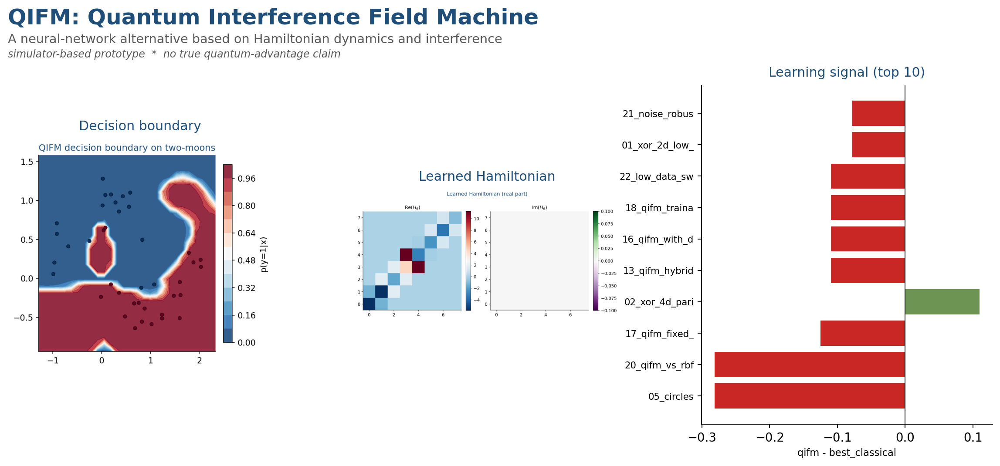
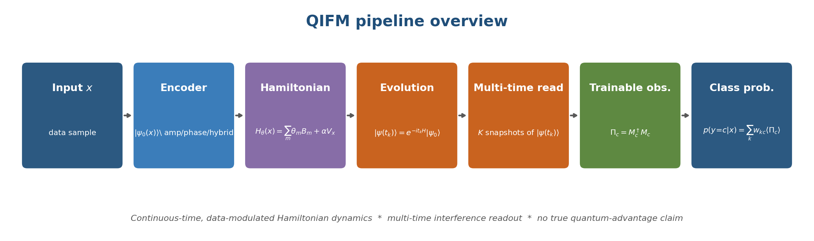
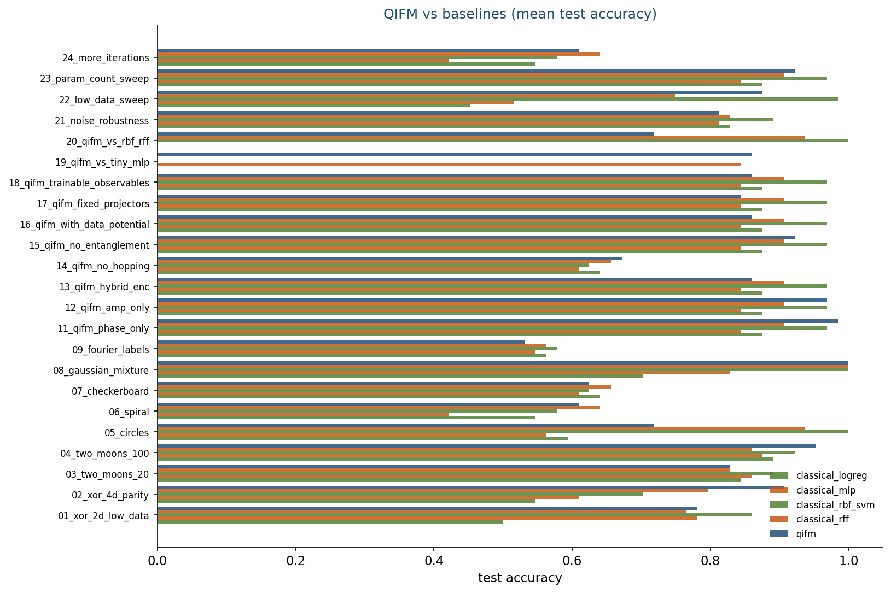
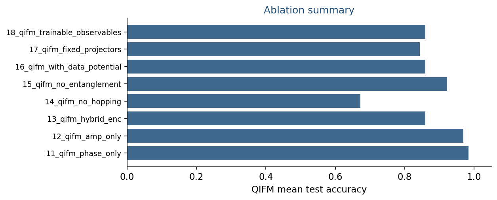
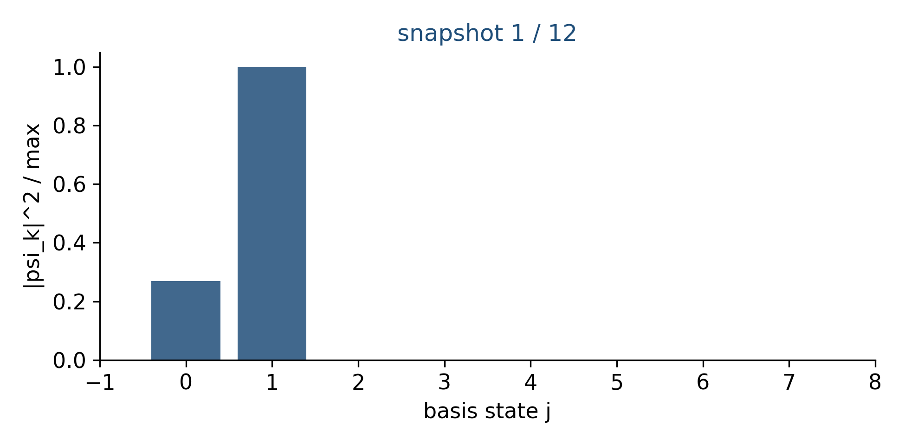

# QIFM: Quantum Interference Field Machine



> A simulator-based research prototype of a model that replaces the
> layers / neurons / activations stack of a neural network with continuous-
> time Hamiltonian dynamics on a small complex Hilbert space, multi-time
> interference readout, and Born-rule class probabilities. Continuous
> trainable parameters live in the Hamiltonian and in a trainable
> observable basis.
>
> We measure a **matched-budget quantum signal** — performance against
> classical baselines (logistic regression, tiny MLP, RBF SVM, random
> Fourier features) at equal data and parameter budgets. We make **no
> claim of true quantum advantage.**

## Abstract

Given an input $x \in \mathbb{R}^d$:

1. Encode $x$ as an initial complex state $|\psi_0(x)\rangle \in \mathbb{C}^N$
   via an amplitude / phase / hybrid encoder.
2. Build a trainable Hamiltonian
   $H_\theta(x) = \sum_m \theta_m B_m + \alpha V_x$
   from a small physics-flavoured basis (local potentials, nearest-neighbour
   hopping, graph Laplacian) plus a diagonal data-dependent potential $V_x$.
3. Evolve under continuous time:
   $|\psi(t_k)\rangle = e^{-i t_k H_\theta(x)} |\psi_0(x)\rangle$
   at $K \ge 2$ snapshot times.
4. Read out class scores by combining Born probabilities under trainable
   observable projectors $\Pi_c = V^\dagger |c\rangle\langle c| V$:
   $s_c = \sum_k w_{kc} \langle \psi(t_k) | \Pi_c | \psi(t_k) \rangle$,
   $p(y=c | x) = \mathrm{softmax}(s_c)$.

All continuous parameters $(\theta, w, V, \alpha)$ are trained jointly by
cross-entropy minimisation with L-BFGS-B.

## Pipeline



## Why this is not a standard neural network

| Standard NN                                | QIFM                                          |
|--------------------------------------------|-----------------------------------------------|
| Layered affine maps + pointwise non-linearity | Continuous-time unitary evolution under a trainable Hamiltonian |
| ReLU / GELU / tanh introduce non-linearity | Born-rule squared modulus introduces non-linearity via interference |
| Hidden activations live in $\mathbb{R}^h$  | States live in $\mathbb{C}^N$ on complex projective space |
| Output via affine + softmax                | Output via trainable observable projectors + softmax over snapshot-weighted Born probabilities |
| Data enters only at the input layer        | Data also modulates the Hamiltonian via the potential $V_x$ |

The QIFM forward map is norm-preserving by construction
($U^\dagger U = I$); a neural network is not. Interference between the
multiple time snapshots is what generates the model's non-linearity, not
a pointwise activation function.

## Quantum ingredients

- Pure complex states $|\psi\rangle \in \mathbb{C}^N$.
- Hermitian Hamiltonians $H = \sum_m \theta_m B_m$.
- Unitary evolution $U(t) = e^{-i t H}$.
- Multi-time snapshot readout $\{|\psi(t_1)\rangle, \dots, |\psi(t_K)\rangle\}$.
- Trainable observable projectors built from an orthonormal isometry.
- Born-rule class probabilities + softmax over snapshot-weighted scores.

## Algorithm

```
forward(x):
    psi0   = encode(x)                       # amplitude / phase / hybrid
    H      = sum_m theta_m B_m + alpha V_x   # data-modulated Hamiltonian
    evolve = SpectralEvolver.from_H(H)
    s      = zeros(C)
    for k in range(K):
        psi_k = evolve.evolve(psi0, t_k)
        for c in range(C):
            s[c] += w[k, c] * <psi_k | Pi_c | psi_k>
    return softmax(s)

train(X, y):
    minimise cross-entropy over (theta, w, V, alpha) via L-BFGS-B
```

## Quickstart

```bash
python -m venv .venv && source .venv/bin/activate
pip install -r requirements.txt

python scripts/run_all_experiments.py --quick   # ~10 minutes
python scripts/build_release_media.py
pytest -q
```

## Experiments (24)

| #  | Name                               | Dataset           | Probes                                       |
|---:|------------------------------------|-------------------|----------------------------------------------|
| 01 | `01_xor_2d_low_data`               | xor_2d            | classical NN-hard target                     |
| 02 | `02_xor_4d_parity`                 | parity_4d         | 4-D parity                                   |
| 03 | `03_two_moons_20`                  | two_moons (20)    | low-data classification                      |
| 04 | `04_two_moons_100`                 | two_moons (100)   | medium-data classification                   |
| 05 | `05_circles`                       | circles           | non-linear separation                        |
| 06 | `06_spiral`                        | spiral            | high-frequency boundary                      |
| 07 | `07_checkerboard`                  | checkerboard      | high-frequency periodic                      |
| 08 | `08_gaussian_mixture`              | gaussian_mixture  | multimodal classes                           |
| 09 | `09_fourier_labels`                | fourier_labels    | sinusoidal label boundary                    |
| 10 | `10_sparse_signal`                 | sparse_signal     | sparse binary inputs                         |
| 11 | `11_qifm_phase_only`               | two_moons         | encoding ablation: phase only                |
| 12 | `12_qifm_amp_only`                 | two_moons         | encoding ablation: amplitude only            |
| 13 | `13_qifm_hybrid_enc`               | two_moons         | encoding ablation: hybrid                    |
| 14 | `14_qifm_no_hopping`               | checkerboard      | basis ablation: no hopping                   |
| 15 | `15_qifm_no_entanglement`          | two_moons         | basis ablation: no graph Laplacian           |
| 16 | `16_qifm_with_data_potential`      | two_moons         | data-modulated H                             |
| 17 | `17_qifm_fixed_projectors`         | two_moons         | fixed-projector ablation                     |
| 18 | `18_qifm_trainable_observables`    | two_moons         | trainable-observable ablation                |
| 19 | `19_qifm_vs_tiny_mlp`              | two_moons         | head-to-head vs 4-hidden MLP                 |
| 20 | `20_qifm_vs_rbf_rff`               | circles           | head-to-head vs RBF SVM and RFF              |
| 21 | `21_noise_robustness`              | two_moons (noise) | noise robustness                             |
| 22 | `22_low_data_sweep`                | circles (16)      | low-data sweep                               |
| 23 | `23_param_count_sweep`             | two_moons         | smaller-Hilbert-dim QIFM                     |
| 24 | `24_more_iterations`               | spiral            | longer training                              |

Numerical results land in `outputs/experiments/all_metrics.csv`,
`outputs/experiments/all_metrics.json`,
`outputs/experiments/bootstrap_summary.csv`, and
`outputs/experiments/per_experiment_plots/`.

## Matched-budget quantum signal

For each experiment we compute the difference between QIFM's mean
accuracy and the best classical baseline's mean accuracy on the same
split. A positive number means QIFM beats the best classical baseline at
matched data and parameter budget.




## Sample animation



The 12-snapshot animation tracks $|\psi(t_k)|^2$ over the basis as the
state evolves under a trained Hamiltonian. The full cinematic summary
lives at `outputs/release_media/cinematic_summary.mp4` and
`outputs/release_media/cinematic_summary.gif`.

## Limitations

- **Simulator only.** All quantum computation runs on numpy + scipy at
  $N \le 8$. Nothing about the construction requires a quantum computer
  at these scales.
- **Tiny optimiser.** L-BFGS-B with finite-difference gradients handles
  modest parameter counts (~30-60). Scaling QIFM requires differentiable
  matrix-exponential evaluation (JAX or PyTorch autograd through `expm`).
- **Synthetic data.** Most datasets are classic 2-D / 4-D shapes. The
  parity, XOR, and Fourier-label tasks are deliberately chosen because
  classical methods struggle on them at low data.
- **No noise model.** A real-hardware estimation of $\langle\Pi_c\rangle$
  would introduce shot noise that this prototype ignores.
- **Single optimisation method.** Adam, natural-gradient, or trust-region
  methods would likely tighten the comparison.

## Honesty note

We do **not** claim a true quantum advantage. The signal we report is a
matched-budget performance difference on a controlled simulator-based
benchmark. A real-world claim requires a problem class where no efficient
classical algorithm is known, an honest accounting of shot noise and
calibration, and an experimental protocol the classical baseline cannot
match. QIFM is a methodological prototype, not a benchmark of quantum
hardware.

## License

Research prototype. No license file is shipped.
