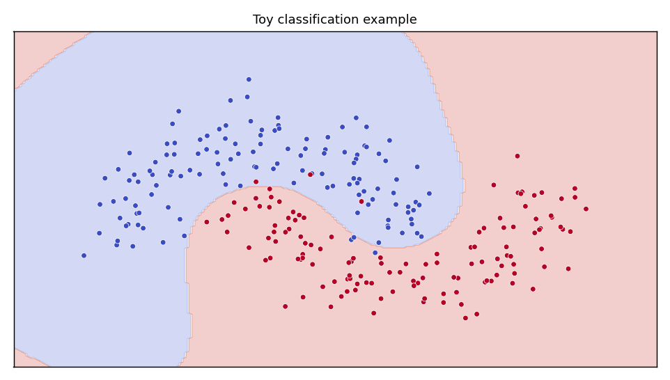
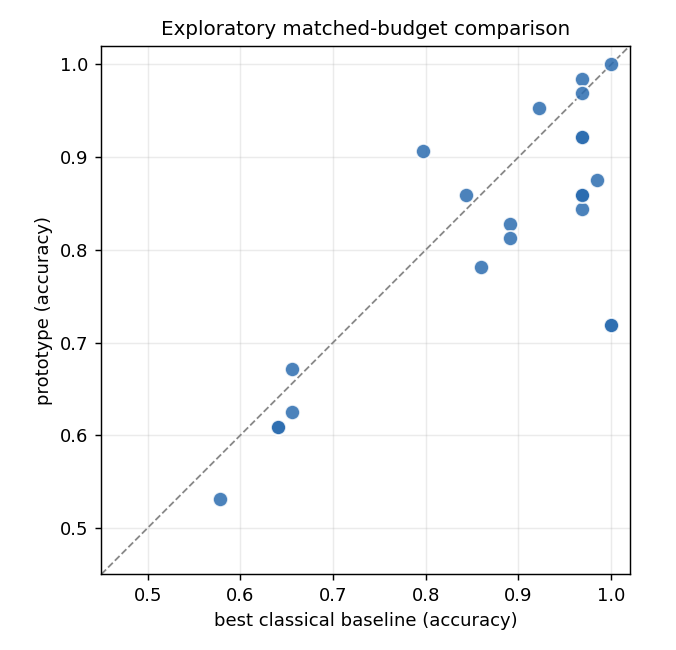
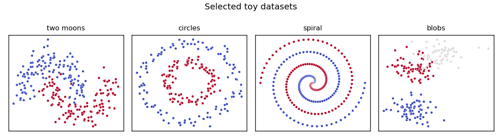

# QIFM: Quantum Interference Field Machine

A simulator-based research prototype exploring a continuous-time, dynamics-based
alternative to small neural-network classifiers, compared against classical
baselines at matched data and parameter budgets.

<p align="center">
  
</p>

> Exploratory simulator-based research prototype. No quantum-advantage claim.

## What this explores

Whether a small continuous-state dynamical model can act as a classifier on toy
2-D / low-dimensional tasks, and how it compares with standard classical
baselines (logistic regression, a tiny MLP, RBF SVM, random Fourier features)
when given the same data and parameter budget. Everything runs on a classical
simulator at small scale.

## Selected visuals

<p align="center">
  
</p>

*Exploratory matched-budget comparison on toy classification tasks (simulator).
Each point is one task; the dashed line is parity. Results are mixed.*

<p align="center">
  
</p>

*Selected toy datasets used for the exploration.*

## How to run

```bash
python -m venv .venv && source .venv/bin/activate
pip install -r requirements.txt

python scripts/run_all_experiments.py --quick
pytest -q
```

## Honest status

- This is an exploratory research prototype.
- Results are simulator-based.
- No quantum advantage is claimed.
- No state-of-the-art claim is made.
- Some classical baselines match or outperform the prototype.
